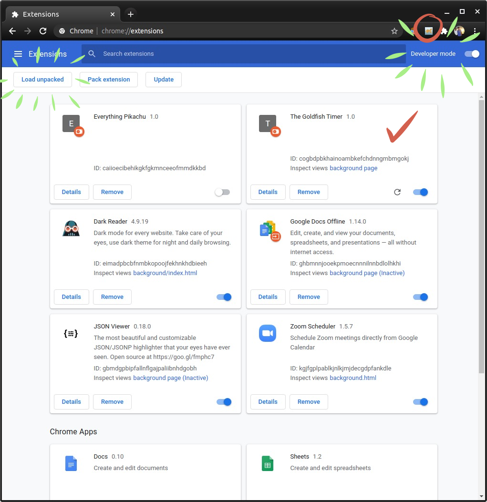
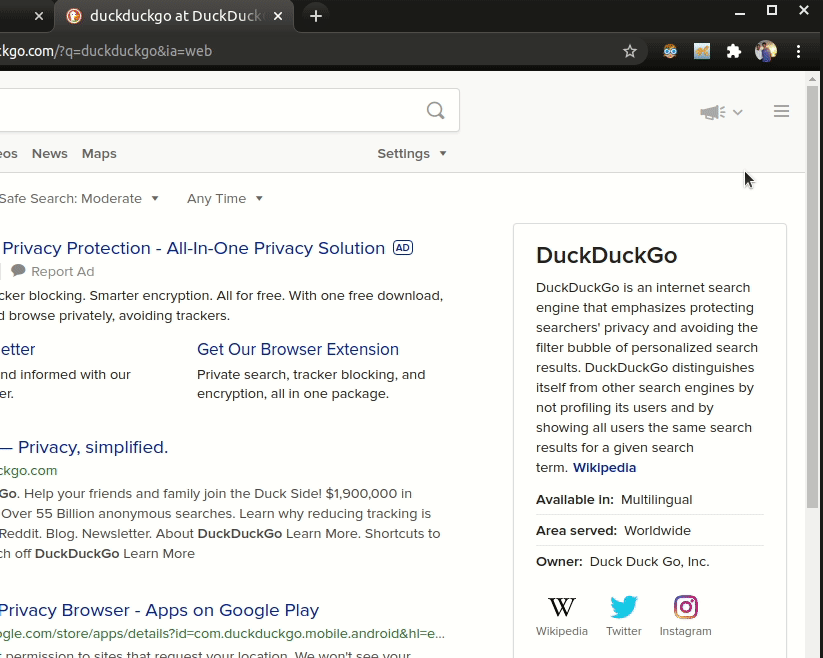
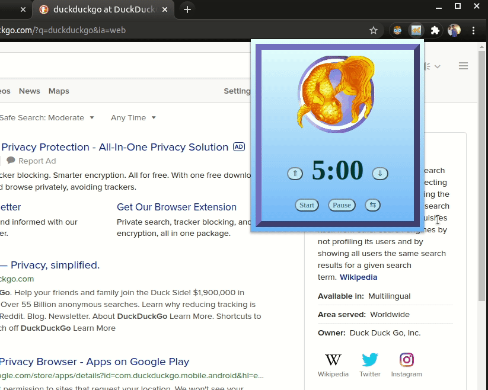
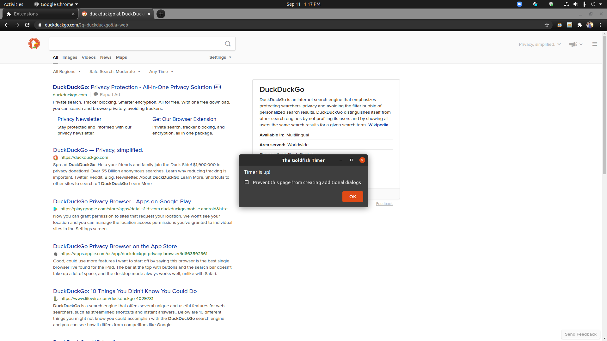
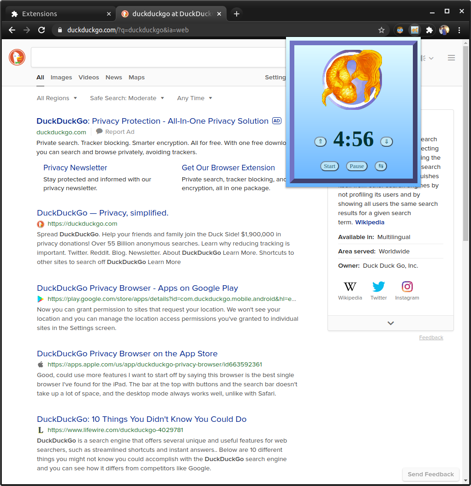

# Goldfish Timer

## What's Goldfish Timer?
> Do you struggle to stay productive? Are you tired of googling a boring default timer off of Google for your timer needs?<br> <br>Do you have the attention-span of a goldfish? <br><br> Well now you can use Goldfish Timer! Fully customizable  timer that can play in the background while you work, pause, and reset whenever you need. 

## How do I install it?
> This extention is (or will be soon...) available as a Google chrome extension! <br><br> Once our extension is available we will provide the link here!<br><br> **But in the meantime!** <br><br>You just need to clone down the repo and load unpack the extension in the chrome extensions tab (make sure you have the developer mode enabled!) and boom! It's ready to use! 

## Screenshots! Gifs!
<br>
<br>
<br>
<br>
<br>

## Code Samples
```Javascript
const tick = () => {
    let myAlarm = new Audio('Fishtank_Bubbles-SoundBibleco-amanda-1550139304.mp3')
    let min = Math.floor(secondsRemaining / 60); 
    let sec = secondsRemaining - (min * 60);
    if (sec < 10) {
        sec = "0" + sec;
    }
    let timer = min.toString() + ":" + sec;
    currentTimer = timer;
    console.log(timer)
    if (secondsRemaining === 0){
        isRunning = !isRunning;
        myAlarm.play();
        clearInterval(displayTimer);
        setTimeout(alert("Timer is up!"), 200);
    }
    secondsRemaining--;
}
```

## Tech-y stuff!
* HTML
* CSS
* Vanilla JavaScript
* A dash of chrome-speak (chrome extension syntax) know-how

## Credits
* [Jay Oliver](https://github.com/Qwerter49)
    * jay.oliver.technologies@gmail.com
* [Sydney Goldberg](https://www.linkedin.com/in/sydney-goldberg-32b9751b0/)
    * sydney.goldberg@outlook.com

**Music Credit**
* [Amanda](http://soundbible.com/1571-Fishtank-Bubbles-2.html)


## License
[MIT](https://choosealicense.com/licenses/mit/)
